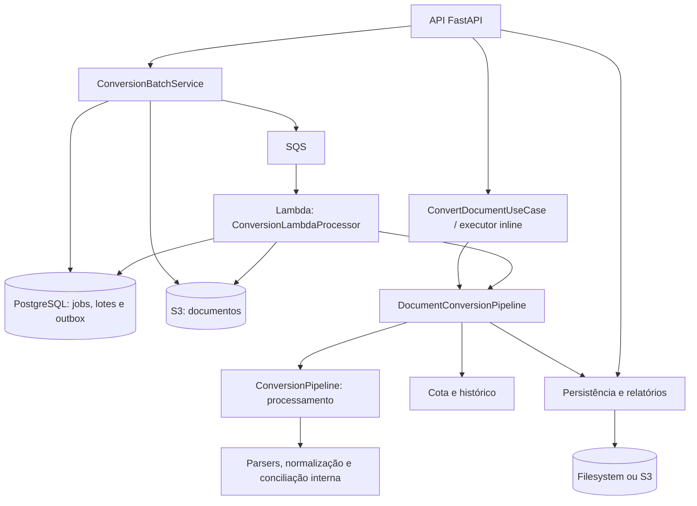

# Análise e plano de modularização do backend

Data: 09/09/2026. Base: `main`, commit `8e1c30cdc4e863159511474fb372d6b33aac8b9e`.
Escopo: backend Python, worker Lambda, contratos compartilhados, persistência,
Docker e validação. Frontend considerado somente na compatibilidade HTTP.
Este documento propõe trabalho futuro; não altera a aplicação nem a infraestrutura.

## Parecer

A modularização merece melhorias. A recomendação é manter um único repositório,
com módulos por responsabilidade de negócio, um motor compartilhado de processamento
e dois runtimes: API e worker. A separação operacional do worker faz sentido.

`app/application` não é redundante apenas pelo nome: `app` pode nomear o pacote e
`application` uma camada de casos de uso. Neste projeto, porém, essa camada reúne
parsers, SQL, armazenamento, AWS, autenticação, cobrança, apresentação e orquestração.
Ela deixou de comunicar uma fronteira clara. Renomeá-la sozinha teria pouco efeito.

A lista de exclusões do Docker é um sintoma dessa mistura. Hoje há isolamento
funcional do worker, mas sua distribuição ainda depende de selecionar arquivos de
um pacote muito abrangente. O objetivo é conseguir montar a imagem com pacotes
completos e coesos, mantendo verificações de importação e conteúdo.

Não há evidência nesta revisão que justifique separar mais serviços ou repositórios.
O maior ganho imediato vem de corrigir fragilidades de importação e concorrência,
definir contratos e terminar extrações já iniciadas.

## O que existe hoje



O diagrama resume caminhos existentes, não a configuração efetivamente ativa em
produção. O worker também pode despachar eventos pendentes da outbox.

Há fundações úteis a preservar:

- `ConversionJob` é um comando imutável; callbacks ficam em `ConversionExecutionHooks`.
- Existem interfaces como `ConversionAccessPort`, `ConversionDocumentStore`,
  `ConversionBatchRepository` e `AnalysisRepository`.
- API e Lambda reutilizam `DocumentConversionPipeline` e o motor de processamento.
- Jobs/lotes têm persistência, idempotência, lease, retry e outbox; isso deve ser
  preservado durante a reorganização.
- O worker tem requirements próprios, build em estágios e contrato de imagem.
- Parsers por layout, perfis declarativos e testes de regressão já permitem mudanças incrementais.

Inventário de arquivos `.py` em `backend/app`, incluindo `__init__.py`, e linhas
físicas, incluindo comentários e linhas vazias:

| Medida | Resultado |
| --- | ---: |
| Arquivos Python no app | 176 |
| Arquivos Python em `application` | 146 |
| Arquivos Python diretamente em `application` | 46 |
| `application/pdf_parser.py` | 2.415 linhas |
| `application/storage_service.py` | 1.172 linhas |
| `application/conversion/document_conversion_pipeline.py` | 1.019 linhas |
| `application/access_control/__init__.py` | 892 linhas |
| `application/default_conversion_pipeline.py` | 494 linhas |
| `app/schemas.py` | 622 linhas |

Tamanho orienta a inspeção; as responsabilidades e dependências abaixo fundamentam o diagnóstico.

## Achados e prioridade

### P1 — Contexto mutável compartilhado no parser PDF

[`pdf_parser.py`](../backend/app/application/pdf_parser.py#L68) mantém
`_REFERENCE_MONTH_YEAR_CONTEXT` no módulo. `parse_pdf_transactions` troca e restaura
esse valor durante a execução. O
[`ConversionCapacityController`](../backend/app/application/conversion/conversion_capacity.py#L47)
permite de uma a quatro threads no mesmo processo; o padrão é uma.

Em um experimento isolado com duas chamadas ao método real, sincronizando as
threads e substituindo a extração e o parsing de linhas por funções controladas,
o contexto esperado e observado foi:

```text
Expected context A: (1, 2024) Observed: (2, 2025)
Expected context B: (2, 2025) Observed: None
```

Isso demonstra interferência no estado compartilhado. Não demonstra que um
documento real tenha sido convertido incorretamente em produção. A configuração
ativa de concorrência não foi consultada.

Plano: passar um contexto imutável por chamada até os parsers de layout; criar um
teste determinístico com duas conversões e referências diferentes. Corrigir antes
de ampliar a concorrência ou fazer uma movimentação ampla dos parsers.

### P1 — Imports dependem da ordem de inicialização

Este comando, executado na raiz em um processo novo, falha:

```powershell
backend\venv\Scripts\python.exe -c "import sys; sys.path.insert(0, 'backend'); import app.application.pdf_parser"
```

```text
ImportError: cannot import name 'parse_pdf_transactions' from partially initialized module 'app.application.pdf_parser'
```

O ciclo observado é `pdf_parser` → `parsers/__init__.py` → `parsers/bank_statement.py`
→ `pdf_parser`. Importar `app.application.parsers` primeiro também revelou outro
ciclo: `parsers.service` → `conversion/__init__.py` → `document_extractor` →
`parsers.service`.

O [`application/__init__.py`](../backend/app/application/__init__.py) já é uma
fachada com carregamento sob demanda. Os `__init__.py` de
[`parsers`](../backend/app/application/parsers/__init__.py) e
[`conversion`](../backend/app/application/conversion/__init__.py) ainda importam
implementações amplas imediatamente. O caminho de inicialização do worker funciona;
isso não garante que cada módulo possa ser importado de forma independente.

Plano: reduzir os inicializadores, migrar consumidores para imports explícitos e
testar os módulos públicos separadamente em subprocessos. Preservar temporariamente
os exports antigos necessários. Apenas colocar imports dentro de funções não
substitui a correção da direção das dependências.

### P1 — Fronteira do worker depende de exclusões por arquivo

[`Dockerfile.lambda`](../Dockerfile.lambda#L27) copia `application`, `data`,
`workers` e `schemas.py`. O
[`Dockerfile.lambda.dockerignore`](../Dockerfile.lambda.dockerignore) começa
excluindo tudo, inclui toda a árvore `application/**` e depois exclui arquivos de
administração, autenticação, checkout e outros recursos.

O mecanismo funciona para as exclusões declaradas. Um novo serviço colocado em
`application` entra nesse conjunto, a menos que se atualizem as regras.
[`worker_image_contract.py`](../backend/app/workers/worker_image_contract.py)
verifica caminhos, imports e distribuições proibidos e executa um smoke CSV. É uma
proteção útil, mas suas listas também precisam conhecer os componentes proibidos.

O arquivo específico de ignore tem precedência sobre o `.dockerignore` da raiz;
a última regra correspondente determina inclusão ou exclusão. Portanto, mudanças
somente no ignore da raiz não resolvem o contexto da Lambda.
[Referência: Docker, build context](https://docs.docker.com/build/concepts/context/#dockerignore-files).

Plano: separar os módulos compartilhados e os adaptadores necessários ao worker;
depois copiar esses pacotes explicitamente. Manter regras para arquivos locais,
caches e segredos em cada contexto aplicável. Não remover as exclusões atuais
enquanto os imports ainda dependerem da estrutura antiga.

### P2 — Interfaces e implementações estão no mesmo lugar

- [`conversion_access.py`](../backend/app/application/conversion/conversion_access.py#L28)
  contém tanto `ConversionAccessPort` quanto `PostgresConversionAccessService`.
- [`conversion_document_store.py`](../backend/app/application/conversion/conversion_document_store.py#L18)
  reúne referência de documento, interface, filesystem e S3.
- `conversion_job_repository.py` reúne contratos e implementação filesystem;
  `conversion_batch_repository.py` inclui implementação em memória.
- [`conversion_batch_service.py`](../backend/app/application/conversion/conversion_batch_service.py#L16)
  usa uma interface para upload, mas importa o tipo de retorno e a implementação
  do serviço S3 no mesmo módulo.

Plano: mover dados e interfaces para contratos do recurso e implementações para
adaptadores. Os casos de uso recebem essas interfaces; a montagem das dependências
escolhe PostgreSQL, filesystem, S3 ou SQS. Os adaptadores de cota existentes já
compartilham funções de persistência: preservar esse reaproveitamento, evitando
criar uma segunda regra de cobrança ao separá-los fisicamente.

### P2 — Resultado do processamento ainda se mistura com apresentação HTTP

[`analysis_response_builder.py`](../backend/app/application/analysis_response_builder.py#L3)
persiste resultado e monta modelos de `app.schemas`. O pipeline compartilhado
importa esse arquivo. Por isso o worker ainda precisa de `schemas.py`, que também
contém modelos de login, administração e checkout. Não significa que importe
FastAPI; significa que a fronteira dos dados ainda é ampla.

Existem duas classes chamadas `ConversionPipelineResult`: uma representa o resultado
do motor; outra, o estado da execução do job. São conceitos diferentes, não
duplicações que devam ser fundidas automaticamente.

Plano: diferenciar `ProcessingResult`, `JobExecutionResult` e a resposta HTTP;
aproveitar `StructuredConversionResult` e `PersistedConversionResult` existentes.
Retirar apresentação HTTP do caminho de persistência. Preservar o formato dos
payloads já gravados e consumidos pela API até uma evolução explicitamente versionada.

### P2 — Extrações de responsabilidades ficaram incompletas

| Componente | Responsabilidades ainda reunidas | Extração recomendada |
| --- | --- | --- |
| `pdf_parser.py` | Extração nativa, escolha de OCR, retries, parsing agrupado/tabular, contexto e seleção de resultados | Orquestrador PDF, estratégias de parsing e adaptadores de OCR |
| `DocumentConversionPipeline` | Preflight, execução, persistência, cota, histórico, métricas e diagnóstico de falhas | Manter orquestração; extrair finalização e registro de tentativas com contratos explícitos |
| `default_conversion_pipeline.py` | Montagem do motor e regras de saldo, identificação bancária e métricas | Montagem em bootstrap; regras junto ao processamento |
| `TempAnalysisStorage` | I/O, expiração, ownership, edição de transações, recálculo de saldos e relatórios | Repositório de artefatos, casos de uso de edição e exportação |
| `AccessControlService` | Identidade, sessões, cota, planos, checkout, histórico e administração | Serviços por capacidade, usando repositórios pequenos |

[`S3AnalysisStorage`](../backend/app/application/s3_analysis_storage.py#L33)
herda de `TempAnalysisStorage` para usar um cache local. Esse comportamento é
intencional, mas herda também edição e regras de relatório. Extrair essas regras
permite reaproveitá-las por composição sem depender de uma classe de storage ampla.

O [`AdminDashboardService`](../backend/app/application/admin_dashboard_service.py#L37)
acessa `_connect()` do serviço de acesso. Uma interface de consulta de histórico
evitaria depender de métodos privados de autenticação.

### P2 — Montagem do runtime e configuração estão dispersas

[`dependencies.py`](../backend/app/dependencies.py#L90) cria storage e pipeline na
importação e mantém vários serviços globais. A Lambda tem outra montagem em
`build_lambda_processor`. A duplicação de pontos de entrada é apropriada; a
configuração comum e o ciclo de vida das dependências precisam ser explícitos.

Plano: separar configuração validada, factories comuns e montagem web/worker.
Manter inicialização reutilizável na Lambda e inicialização/fechamento controlados
na API. A suíte também aponta o uso descontinuado de `on_event`; a mudança para
lifespan cabe nessa etapa, preservando os fechamentos existentes.

### P2 — Validação de pacote e imagem pode ser antecipada

O CI roda lint, testes e regressão PDF. O build da Lambda está no workflow manual
de deploy; o CI de PR não constrói essa imagem. Parte dos testes de fronteira
verifica texto dos Dockerfiles e um caminho de importação.

Plano: build de validação sem publicação para mudanças relevantes em PR, contrato
dentro da imagem e imports isolados dos módulos públicos. Incluir ao menos PDF
nativo além de CSV: o smoke CSV atual não demonstra que os perfis YAML e recursos
de OCR foram distribuídos corretamente. Validar OCR conforme o modo suportado por
cada imagem, sem presumir equivalência de dependências nativas entre web e Lambda.

### P3 — Existem compatibilidades e redundâncias que pedem classificação

- `csv_parser.py`, `xlsx_parser.py`, `ofx_parser.py`, `bank_parser.py`,
  `sheet_parser.py` e `column_mapping.py` na raiz de `application` têm uma ou duas
  linhas e reexportam implementações de `parsers`. São compatibilidades deliberadas.
- `pdf_parser.py` não é uma fachada pequena: a implementação principal continua nele.
- `normalizer.py` e `conversion_service.py` também merecem inventário de consumidores
  antes da remoção. Alguns testes ainda usam adaptações do fluxo antigo.
- `app/api/conversion` contém apresentação HTTP, enquanto `app/routers` contém
  as rotas. Consolidar a camada HTTP elimina essa divisão de localização.
- `requirements-lambda.txt` apenas inclui `requirements-worker.txt`; verificar
  consumidores externos antes de remover o alias.
- `doc/` e `docs/` coexistem. Unificá-las é uma limpeza posterior e de prioridade baixa.

A imagem web instala `pytest` e `ruff` via `requirements.txt` e usa `COPY backend`.
Há oportunidade de separar requirements de runtime, desenvolvimento e migração,
e tornar o conteúdo copiado mais explícito. Não remover bibliotecas de processamento
da web enquanto os modos inline e fallback continuarem suportados.

## Estrutura proposta

Estrutura indicativa, criada por extrações reais, sem pastas vazias ou uma hierarquia
completa de camadas em cada recurso:

```text
backend/app/
  main.py                    # compatibilidade com o entrypoint atual
  bootstrap/
    settings.py              # configuração comum; módulos por runtime se necessário
    conversion.py            # montagem compartilhada do processamento
    web.py
    worker.py
  api/
    routers/
    schemas/                 # modelos HTTP separados por recurso
    conversion/              # SSE, upload staging e apresentação HTTP
  workers/
    conversion_lambda.py     # entrada SQS/EventBridge e ciclo de vida do worker
    worker_image_contract.py
  conversion/
    contracts.py             # job, referências, identidade mínima e resultados
    ports.py                 # interfaces de cota, histórico, documentos, jobs e fila
    services/                # conversão, lotes, finalização, preflight
  processing/
    models.py                # modelos canônicos compartilhados
    ports.py                 # interfaces de extração e OCR utilizadas pelo motor
    pipeline.py
    parsers/                 # CSV, XLSX, OFX e PDF, incluindo layouts específicos
    normalization/
    classification/
    profiles/                # registry e recursos de layouts
    reconciliation.py       # conciliação interna já usada no motor
  reporting/                 # consulta, edição, ownership e exportação
  reconciliation/            # casos de uso de conciliação entre arquivos
  identity/                  # autenticação e sessões
  billing/                   # planos e checkout
  admin/                     # consultas e operações administrativas
  notifications/             # contato e envio de mensagens
  adapters/
    conversion/              # filesystem, PostgreSQL, S3, SQS e persistência de cota
    reporting/               # armazenamento de análises e artefatos
    ocr/                     # Textract e OCR local
    identity/
    billing/
    notifications/
  data/                      # catálogo bancário e outros recursos compartilhados
```

Os nomes finais podem ser ajustados em cada PR. A decisão essencial é a direção
das dependências:

1. `processing` não importa API, worker, autenticação ou casos de uso de conversão.
   Tipos de documento necessários ao motor devem morar em contratos de baixo nível,
   sem dependência de serviços ou inicializadores de outros recursos.
2. Casos de uso dependem de modelos e interfaces. Integrações AWS, banco e filesystem
   implementam essas interfaces em `adapters`.
3. `bootstrap` é o ponto que conhece implementações concretas e constrói os serviços.
   O bootstrap do worker não importa o bootstrap web.
4. API e worker chamam o mesmo núcleo de conversão. HTTP/SSE e SQS continuam sendo
   adaptadores de entrada diferentes, com semânticas de execução próprias.
5. Dependências entre recursos usam contratos pequenos. Por exemplo, conversão
   recebe identidade e limite autorizados; não autentica usuário no worker.
6. `__init__.py` não inicializa serviços nem importa indiscriminadamente todos os
   submódulos. Fachadas temporárias ficam identificadas e cobertas por testes.

Aplicar essas regras no CI com verificações estáticas das dependências proibidas,
além dos imports em subprocessos. Isso também detecta imports locais dentro de
funções que um smoke de inicialização não exercita.

O motor compartilhado é um pacote Python no mesmo repositório. Publicar uma
biblioteca separada só deve ser reconsiderado se surgirem consumidores ou ciclos
de versão independentes que justifiquem esse custo.

## Plano incremental e critérios de aceite

| Etapa | Entrega sugerida | Critério para concluir |
| --- | --- | --- |
| 1 — Confiabilidade | Dois PRs pequenos: ciclos de importação; contexto PDF por chamada | Imports públicos passam em processos novos; teste de duas conversões não mistura contexto; corpus PDF permanece estável |
| 2 — Contratos | Separar portas de adaptadores e resultado de processamento de payload HTTP | Núcleo e interfaces importam sem API/AWS/PostgreSQL; payloads persistidos antigos continuam legíveis |
| 3 — Núcleo e runtimes | Mover processamento, conversão e relatórios em PRs distintos; extrair bootstrap | API e Lambda usam o mesmo núcleo; testes dos modos inline, async e canário passam; entrypoints preservados |
| 4 — Imagens | Copiar módulos coesos; separar requirements; adicionar build de PR sem push | Worker não precisa de exclusões de serviços web por arquivo; CSV/PDF e recursos funcionam dentro da imagem |
| 5 — Responsabilidades grandes | Extrair estratégias PDF, finalização de conversão e edição/exportação de storage, um componente por PR | Mesmos resultados de negócio e formatos; cota, ownership, TTL e conflitos de edição preservados |
| 6 — Recursos periféricos e limpeza | Separar identidade/cobrança/admin/contato; consolidar API e aposentar fachadas comprovadamente sem consumidores | Fronteiras testadas; novos consumidores usam módulos explícitos; documentação reflete os fluxos atuais |

Na etapa 3, cada movimentação deve atualizar os caminhos do build e preservar as
exclusões necessárias. A etapa 4 elimina a seleção de arquivos legados somente
quando a árvore compartilhada estiver autossuficiente. Movimentações puras e
alterações de comportamento devem ficar em PRs distintos sempre que possível.

As regras e contagens de linhas não devem virar metas artificiais. O aceite é
conseguir alterar um recurso, importar seus contratos e empacotar o worker sem
carregar serviços alheios ou editar listas de exclusões a cada novo serviço web.

## Compatibilidade, rollout e rollback

O plano inicial não requer migração de schema. Preservar tabelas, colunas, nomes
de campos JSON, estados dos jobs, identificadores, chaves S3, ownership, expiração,
contratos de erros, SSE e o consumo idempotente de cota.

API e Lambda podem rodar revisões diferentes. Validar produtor novo/consumidor
anterior e produtor anterior/consumidor novo para mensagens e resultados
persistidos. Manter o envelope SQS `schema_version=1` e a leitura de jobs já
enfileirados; qualquer evolução de contrato exige estratégia explícita de versões.
Não presumir que mudanças em dataclasses sejam somente internas: o repositório
PostgreSQL serializa dados de documento, identidade e preflight.

Manter `app.main:app` e `app.workers.conversion_lambda.lambda_handler` durante a
migração, com wrappers mínimos quando necessário. Preservar também os modos
suportados por `ConversionRuntimeConfig` e o canário por usuário. A separação das
pastas não é motivo para retirar o fallback inline.

Para cada PR de implementação: TDD nas regras alteradas, testes de contrato e
regressão relevantes, suíte completa e lint. Mudanças que afetem a execução devem
validar `/convert`, download do resultado e caminho negativo por HTTP real; lotes
devem cobrir submit, consulta e obtenção do resultado. Se a conciliação mudar,
incluir transferência interna, estorno e agrupamento de possível duplicidade.

O AGENTS e o template ainda citam um happy path de `POST /analyze`, mas o runtime
atual não registra essa rota e há testes afirmando sua indisponibilidade. Atualizar
essa orientação em um PR de documentação específico para refletir o contrato
vigente; não reativar a rota para satisfazer uma instrução antiga. Autenticação e
administração já existem e devem ser preservadas apesar da descrição histórica de MVP.

Antes de mover layouts e catálogos, testar sua presença na imagem: o registry usa
caminho relativo a `__file__` e `bank_catalog.py` resolve `data/banks_br.json`.
Uma imagem que importa corretamente ainda pode estar sem recursos necessários.

Rollout: validar as imagens, liberar o worker pelo canário existente e observar
erros, retries, idade da fila, duração, jobs terminais, artefatos e consumo de cota.
Registrar digests e versões da API. Rollback deve restaurar as imagens anteriores
compatíveis com os jobs/resultados produzidos durante o rollout. Uma mudança futura
de schema exige plano próprio de migração aditiva e reversão.

## Validação desta revisão e limites

Na raiz do repositório, usando o ambiente virtual do projeto:

```text
backend\venv\Scripts\python.exe -m pytest backend/tests -q
954 passed, 1 skipped, 2 xfailed, 2 warnings in 109.78s

backend\venv\Scripts\python.exe -m ruff check backend
All checks passed!

backend\venv\Scripts\python.exe scripts/lint_frontend_text.py
Frontend text lint passed.

backend\venv\Scripts\python.exe scripts/lint_frontend_navigation.py
Frontend navigation lint passed.
```

As duas advertências são sobre `on_event` descontinuado. A suíte inclui testes HTTP,
fronteira do worker e regressão PDF; não foi criado um servidor manual adicional
para esta mudança exclusivamente documental.

As verificações isoladas de importação e concorrência descritas acima expuseram
problemas preexistentes apesar da suíte verde. Nenhum deles foi corrigido nesta
revisão. O experimento concorrente substituiu leitura de PDF, parsing de linhas e
pós-processamento por funções controladas, manteve a troca real do contexto no
método público e usou eventos para reproduzir a intercalação sem depender de sleeps.

Não foram construídas ou publicadas imagens, acessadas contas AWS/Render, consultados
dados de produção ou alteradas dependências. Tamanho de imagem, cold start, custo,
concorrência ativa e desempenho de produção não foram medidos. Templates de IaC
mantidos em outro repositório também não foram auditados.

O plano complementa o
[plano anterior de pipeline](plan-convert-document-pipeline-migration.md), cujas
etapas já foram parcialmente implementadas, e preserva as decisões de
[conversão assíncrona](plan-aws-async-batch-conversion.md) e
[isolamento do worker](../docs/worker-runtime-isolation.md).
